# 1. Սկզբունքներ և գործնական քայլեր

Այս շաբաթ իմ աշխատանքը կենտրոնացած էր հիմնական պրոեկտի գաղափարների և իմ վեբ կայքը ստեղծելու շուրջ։

## Հետազոտություն
Սկսեցի ուսումնասիրել Fab Academy-ի նախկին ուսանողների աշխատանքները: Այդ ընթացքում առանձնացրի դոկումենտացման և կոդավորման համար անհրաժեշտ հիմնական գործիքները, այդ թվում՝ Git-ը՝ բովանդակությունը կառավարելու և Fab Academy-ի պահոց (repository) վերբեռնելու համար, ինչպես նաև Visual Studio Code-ը՝ կոդի և Markdown ֆայլերի գրման, խմբագրման ու սպասարկման համար։ Հավելեմ նաև GitHub-ի օգտագործման մասին։ Դրա միջոցով ես կարողանում եմ իմ ֆայլերը պահպանել անվտանգ տեղ, առանց կորցնելու վախի։ Ինչպես նաև դրա միջոցով ուրիշները ևս կարողանում են օգտվել իմ վեբից, ուսումնասիրելով իմ GitHub-ի էջը։

## Օգտակար հղումներ
[Git](https://git-scm.com/install/windows)՝ ծրագրային ապահովում, որն օգտագործում եմ կայքի վրա կատարվող աշխատանքի տարբերակների կառավարման (versioning) համար։

[GitHub](https://github.com/)՝ անվտանգ վայր, որն օգտագործում եմ իմ կայքի կոդերը այնտեղ պահպանելու համար։

[Visual Studio](https://code.visualstudio.com/)՝ գործիք, որն օգտագործել եմ կայքը մշակելու, ինչպես նաև շաբաթական հանձնարարությունների վերաբերյալ աշխատանքը դոկումենտացնելու համար։

## Կարգավորումները մինչ վեբ էջը ստեղծելը
Հետո ներբեռնում եմ ուսուցչի տված պատրաստի template-ը, որը օգտագործում են Fab Acadeny-ի աշակերտները։
Ֆայլը extract all եմ տալիս, ապա այն գցում VS նկարում ցույց տված ձևով։
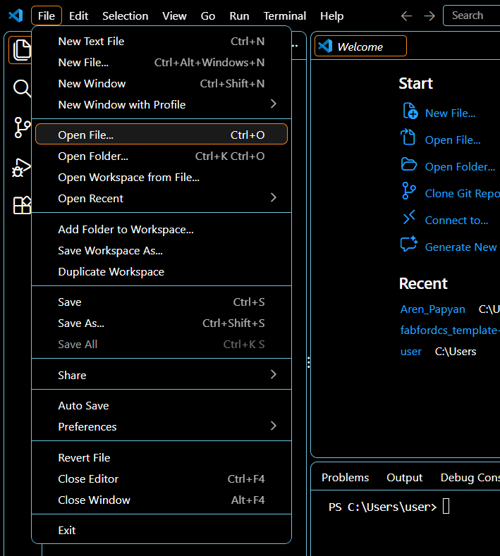

Հիմա անհրաժեշտ է նոր repository ստեղծել GitHub-ում, որպեսզի հենց այդտեղ էլ պահպանեմ իմ կոդերը։
Մտնում եմ [GitHub](https://github.com/), գրանցվում, ապա գնում Home page։
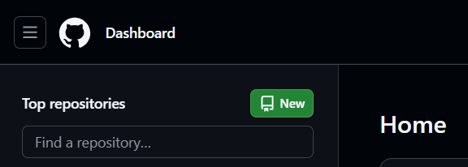

Սեղմում եմ New և ստեղծում իմ repository-ն։
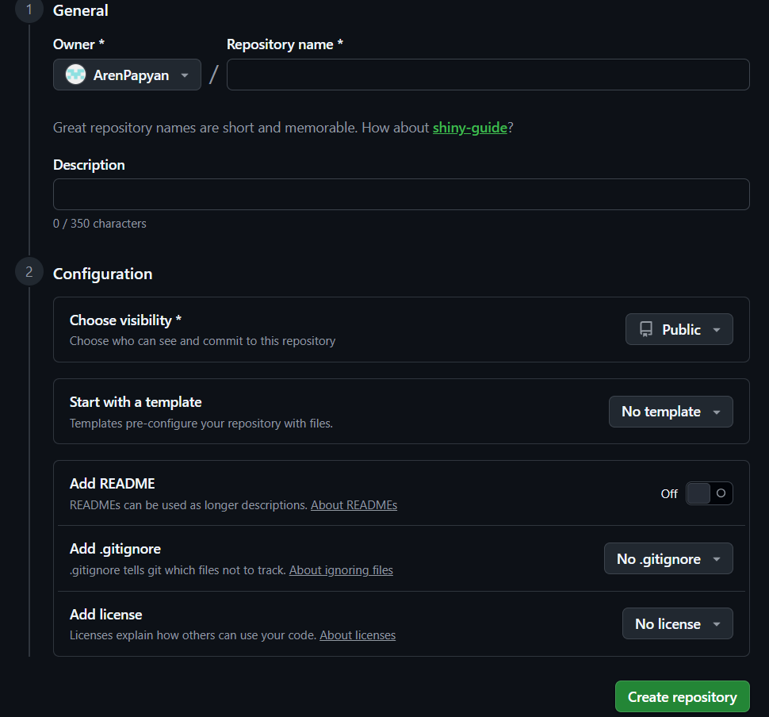
Գրում եմ իմ repository-ի անունը և առանց որևէ այլ բան փոփոխելու տալիս Create repository:
!!!ՈՒշադիր եղեք, որ լինի public։

Այժմ, բոլոր գործիքները ներբեռնելուց, կարգավորելուց և template-ը VS-ում տեղադրելուց հետո, այդ գործիքները միացնում եմ դրանք իրար՝ա ավելի արդյունավետ աշխատելու համար։
Առաջինը՝ Git-ը և VS-ը։
Միացնում եմ VS-ն, անում Ctrl + Shift + ` (եթե տերմինալը փակ է), սեղմելով կարմիր սլաքով նշված մասին, գտնում եմ Git Bush գրությունը, և սեղմում այն։
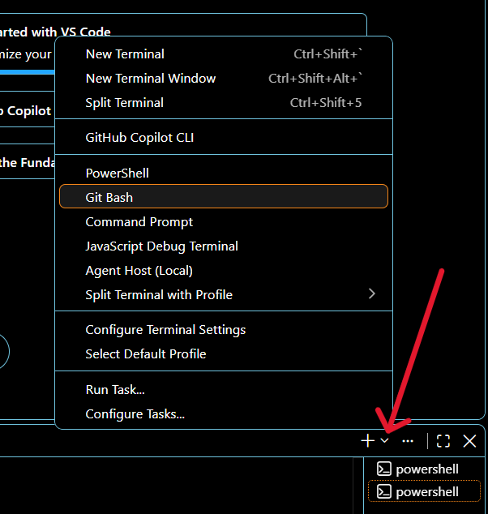

Հիմա բացվում է արդեն terminal-ում ոչ թե powershall-ը, այլ git bush-ը։

Երկրորդը՝ VS-ը և GitHub-ը։
Այն միացնելու համար համացանցից փնտրելուց հհետո պարզեցի, որ այն կարելի է միացնել GitBush-ով։ Հետո ավելի ուշադիր զննելուց հետո հենց GitHub-ում ստեղծած repository-իս Code բաժնում գտա այս կոդերը։
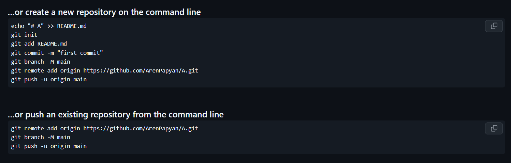
Ստուգելու համար հարցրեցի նաև ChatGPT-ին:
Ահա իր պատասխանը․
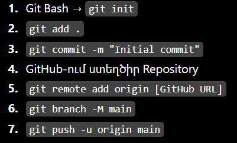

ChatGPT prompt: Շատ կարճ տուր այն քայլերի հերթականությունը, որով կարող եմ GitHub-ս միացնել Virtual Studio-ին GitBush-ով

Ահա հենց այս կոդերն էլ VS-ում terminal-ի մեջ, որտեղ բացել էի git bush-ը, հերթականությամբ գրում եմ այս կոդերը։
Հետո մտնում եմ GitHub->Settings->Pages և Build and Development բաժնում ընտրում Git Hub Actions, որպեսզի տեսնեմ, արդյո՞ք հաջողությամբ կարողացա վեբ կայքս միացնել GitHub-իս։
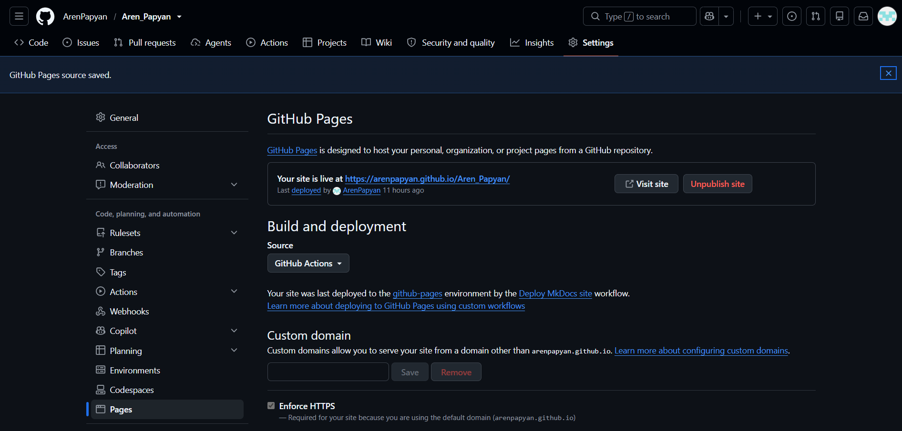
Ըստ տրված նկարի էլ երևում է, որ այն հաջողվել է։

## Վեբ կայքի ստեղծում
Նախ և առաջ, փոխում եմ էջի անունը, հեղինակը և իրավունքները՝ այնտեղ ներառելով իմ անունը։
Ինչպես նաև navigation-ը թարգմանում եմ հայերեն։
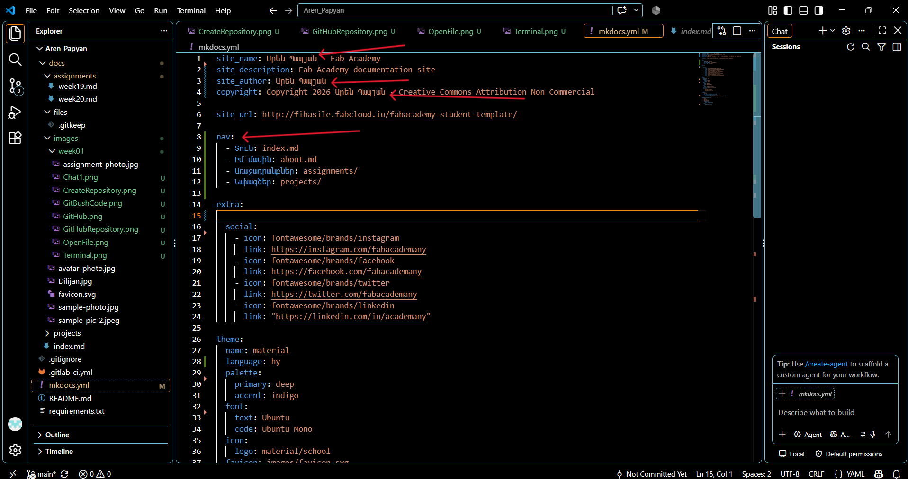
Այնուհետև արդեն սկսում եմ աշխատել նյութի վրա, գրում եմ իմ մասին և առաջին շաբաթվա աշխատանքիս մասին համապատասխան ֆայլերում։
Այժմ այդ տեքստերը գրելուց հետո հարցնում եմ Ai-ին, թե ինչպես այն հիմա push անեմ իմ վեբ էջ, որպեսզի այն օնլայն ցույց տա։
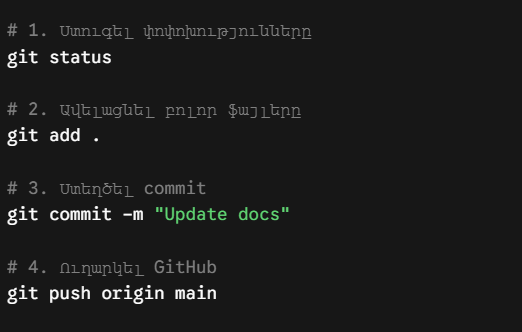

ChatGPT prompt: Ինչպե՞ս VS-ում գրածս նյութերը push անեմ GitHub Gitbush-ի միջոցով:
Այս ամենը գրում եմ GitBush-ում և ընդամենը մի քանի վայրկյանից այն հաջողությամբ push է անում։
Արդեն մտնելով վեբ էջ, կարողանում ենք տեսնել update-ները։

## Գլխավոր խնդիրը
Առաջադրանքի կատարման ընթացքում բախվեցի շատ մանր և տարատեսակ խնդիրների, որոնք, բարեբախտաբար, կարողացա արագ լուծել։ Սակայն մի անգամ բախվեցի այնպիսի խնդրի, որ նույնիսկ Ai-ի օգնությամբ շատ դժվար լուծեցի։ Խնդիրը կայանում էր նրանում, որ push անելու ժամանակ GitBush-ում կոդը գրելուց հետո իմ ֆայլը համակարգչի մեջ GitBush-ը չէր գտնում, սակայն ես այն պատշաճ կերպով մի քանի անգամ ստուգել էի՝ ֆայլը այնտեղ էր։ 
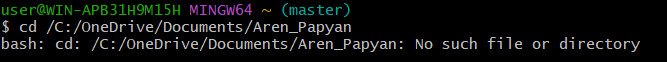
Մի քանի անգամ նույն կոդը, գործողությունները փորձելուց հետո, նույնիսկ նույն ֆայլը ջնջելուց ու նորից ներբեռնելուց հետո խնդիրը մնում էր նույնը։
Դիմեցի Ai-ին․
ChatGPT prompt: Ի՞նչ խնդիր կա, որ ես GitBush-ում, VS-ից GitHub գցելու համար, գրում եմ իմ ֆայլի դիրքը, push անում, բայց այն error է տալիս, նշելով, որ այդպիսի ֆայլ գոյություն չունի։ 
Իհարկե, այն տալիս է մի քանի տարբերակներ, բայց մեկը կար, որ չէի փորձել:
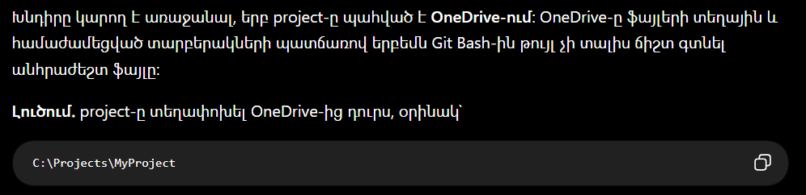
Այսինքն, փաստացի, իմ OneDrive-ը կրկնօրինակում էր ֆայլը, ինչի պատճառով GitBush-ը չէր կարողանում գտնել ֆայլի ճիշտ դիրքը։
Ուղղակի անհրաժեշտ էր ֆայլի տեղը փոխել և այն սկսեց աշխատել։ OneDrive-ից ֆայլը գցեցի Local Disk, որտեղ իմ պանակները OneDrive-ը չի պատճենում, և ամբողջ համակարգը սկսեց նորից աշխատել։
Խորհուրդ․ Git-ի հետ աշխատող project-ները ցանկալի է պահել OneDrive-ից դուրս։

## Լոկալ սերվերի ստեղծում
Ես ուզում էի այնպես կազմակերպել աշխատանքս, որ ամեն անգամ փոփոխություն կատարելուց հետո անմիջապես GitHub չուղարկեմ այն, այլ նախ իմ համակարգչում ունենամ օֆլայն local server, որտեղ կկարողանամ ստուգել կայքի փոփոխությունները, գտնել սխալները և միայն դրանից հետո push անել օնլայն տարբերակը։
Հարցրեցի Ai-ին, թե ինչպես դա կարող եմ անել։
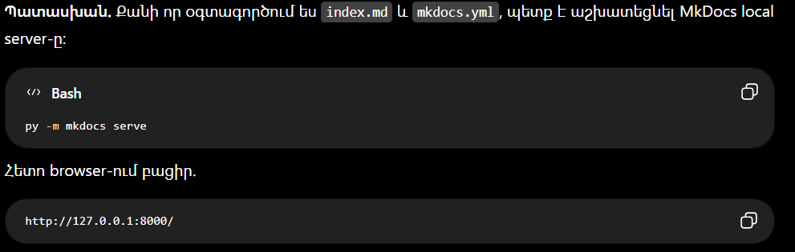
ChatGPT prompt: Ունեմ իմ վեբ էջը, որը գրված է VS-ով GitBush-ի օգնությամբ, GitHub-ին կպած է։ Հիմա ուզում եմ անել այնպես, որ եթե ես մի կոդ գրեմ, ունենամ մի հատ օֆլայն լոկալ սերվեր, որտեղ կկարողանամ ստուգել փոփոխած նյութերս, նոր այն push անեմ օնլայն վեբ սերվեր: Ես օգտագործում եմ ոչ թե HTML, այլ Mkdocs, օրինակ՝ index.md և mkdocs.yml ֆայլեր ունեմ։

Գրեցի այդ կոդը GitBush-ում`
bash: mkdocs: command not found:
Ai-ի պատասխանը․ py -m pip install mkdocs
theme: material error
Ai-ի պատասխանը․ py -m pip install mkdocs-material
git-revision-date-localized plugin error
Ai-ի պատասխանը․ py -m pip install mkdocs-git-revision-date-localized-plugin
!!!Կարևոր․ GitBush-ում գրել py Python-ի փոխարեն, այլապես չի հասկանա և error կտա, ինչպես եղավ ինձ մոտ:

Վերջապես այսքան խնդիրները լուծելուց հետո եկավ այս նկարը։
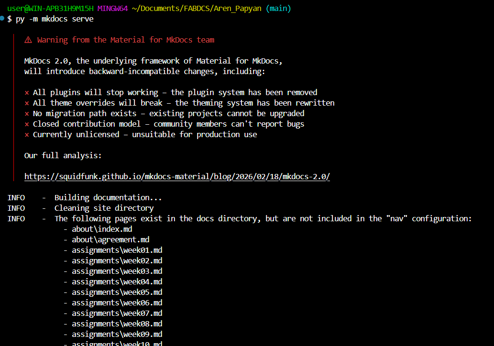
Սակայն այստեղ էլ երևում էին խնդիրներ։ Լոկալ սերվերս բացելու հետո իմ մասին և առաջադրանքներ բաժինները չէր բացվում և 404 Error էր տալիս։
Օգնության եկավ Ai-ը։
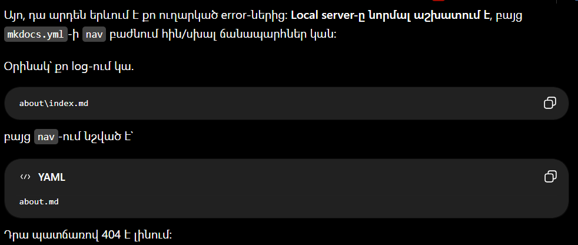
ChatGPT prompt: Լոկալ սերվերիս որոշ բաժինները չի բացում և տալիս է 404 Error, ո՞րն է խնդիրը։
Այսինքն՝ իմ լոկալ սերվերը ուղղակի չէր գտնում անհրաժեշտ պանակի դիրքը։ 
Ամբողջ nav-ի ձևը և կոդը փոփոխեցի

Այժմ ամեն ինչ սկսեց նորմալ աշխատել, բայց էլի բախվեցի խնդրի։ Ոչ մի նկար չկար լոկալ սերվերում։
Պարզվեց մի հետաքրքիր բան։ 
Խնդիրը նկարների path-ի մեջ է։ Քանի որ week01.md-ը գտնվում է assignments պանակում, իսկ նկարները՝ images պանակում, պետք է ./images/-ի փոխարեն օգտագործել ../images/ VS-ի կոդերի մեջ։ Այն միանգամից սկսեց աշխատել։

Այսպիսով՝ ես կարողացա կառուցել իմ լոկալ սերվերը, որը հնարավորություն տվեց ինձ գտնել և ուղղել սխալներս, փորձարկումներ անել՝ նախքան օնլայն վեբ էջ push անելը։

## Եզրակացություն
Այս շաբաթվա ընթացքում ուսումնասիրեցի Fab Academy-ի նախկին ուսանողների աշխատանքները և ձեռք բերեցի վեբ կայք ստեղծելու ու դոկումենտացնելու համար անհրաժեշտ գիտելիքներ։ Սովորեցի աշխատել Git-ի, GitHub-ի և Visual Studio Code-ի հետ, ստեղծեցի իմ repository-ն և հաջողությամբ միացրի այն վեբ կայքիս։

Աշխատանքի ընթացքում հանդիպեցի տարբեր տեխնիկական խնդիրների, որոնք օգնեցին ինձ ավելի լավ հասկանալ ֆայլերի տեղադրությունը, Git Bash-ի աշխատանքը, MkDocs-ի կարգավորումները և նկարների ճիշտ path-երի օգտագործումը։ Ստեղծեցի նաև լոկալ սերվեր, որի միջոցով կարող եմ նախապես ստուգել կայքիս փոփոխությունները և միայն հետո հրապարակել դրանք GitHub-ում։

Այս շաբաթն ինձ օգնեց զարգացնել ինքնուրույն խնդիրներ լուծելու, նոր գործիքներ ուսումնասիրելու և աշխատանքս ճիշտ դոկումենտավորելու հմտությունները։ Ստեղծված հիմքը կարևոր քայլ է իմ հետագա Fab Academy նախագծերի իրականացման համար։
