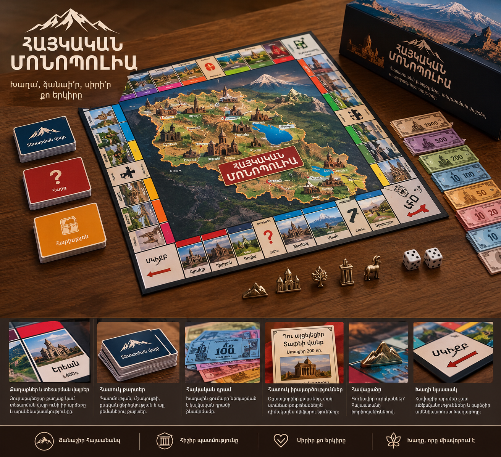

## Հիմնական գաղափարներ
1. 🇦🇲 «Հայաստանը մեկ սեղանի վրա»

Մեծ ինտերակտիվ Հայաստանի քարտեզ, որտեղ յուրաքանչյուր մարզի վրա սեղմելիս կարելի է ստանալ տվյալ մարզի մասին տեղեկություններ՝ պատմություն, տեսարժան վայրեր, հայտնի մարդիկ, խոհանոց, երաժշտություն և այլն։

2. 🕰️ «Հայաստանի ժամանակի մեքենա»

Ինտերակտիվ նախագիծ, որտեղ կարելի է ընտրել Հայաստանի տարբեր պատմական ժամանակաշրջաններ։ Քարտեզը, էկրանը և լուսավորությունը ցույց են տալիս տվյալ ժամանակի կարևոր իրադարձությունները, տարածքները և մշակույթը։

3. 🗺️ «Ճանապարհորդություն Հայաստանի միջով»

Հայաստանի ֆիզիկական քարտեզ, որի վրա փոքրիկ մեքենա կամ այլ ֆիգուր կարելի է տեղափոխել քաղաքների ու տեսարժան վայրերի միջև։ Երբ հասնում ես որևէ վայրի, համակարգը պատմում է դրա մասին, կարող է միացնել համապատասխան ձայն/երաժշտություն և լուսավորել տվյալ հատվածը։

4. 🎲 «Հայկական Մոնոպոլիա»

Մոնոպոլիայի հայկական տարբերակ՝ Հայաստանի քաղաքներով, տեսարժան վայրերով և փողոցներով։ Խաղային գումարը կարող է լինել հայկական դրամի ձևավորմամբ, իսկ հատուկ քարտերը՝ կապված Հայաստանի պատմության և մշակույթի հետ։

5. 🧭 «Գտիր Հայաստանը»

Ինտերակտիվ կրթական խաղ Հայաստանի քարտեզի վրա։ Համակարգը հարց կամ հուշում է տալիս, իսկ խաղացողը պետք է քարտեզի վրա գտնի ճիշտ քաղաքը, մարզը կամ տեսարժան վայրը։ Կարելի է ավելացնել միավորներ, ժամանակաչափ և տարբեր բարդության մակարդակներ։

## Նկարով օրինակ(Հայկական Մոնոպոլիա)
